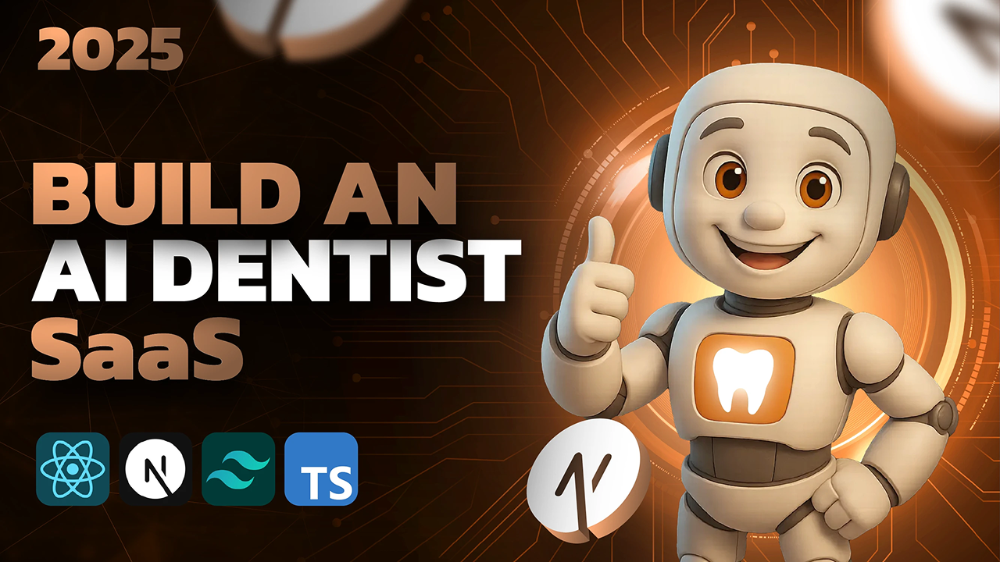

# 🦷 Dentwise – Dental Platform with AI Voice Agent



A modern, full-featured dental appointment booking platform with an AI voice agent, subscription management, and admin dashboard. Built with Next.js, Prisma, and cutting-edge technologies for a seamless user experience.

---

## ✨ Key Features

### 🏠 **Landing Page**
- Modern, responsive design with gradients and hero section
- Pricing section showcasing free and pro plans
- "How It Works" guide for users
- Call-to-action (CTA) sections
- FAQ section on voice agent capabilities

### 🔐 **Authentication & User Management**
- Sign-up and login via **Clerk** (Google, GitHub, Email & Password)
- 6-digit email verification codes
- Automatic user profile sync with Clerk
- Secure session management

### 📅 **Appointment Booking System**
- **3-Step Booking Flow**:
  1. Select dentist/doctor
  2. Choose service and time slot
  3. Confirm appointment details
- Real-time availability checking
- Email confirmations via **Resend**
- Appointment history and management
- Appointment status tracking (CONFIRMED, COMPLETED)

### 🗣️ **AI Voice Agent** (Pro Plans Only)
- Powered by **Vapi AI**
- Natural language scheduling
- Contextual conversation
- Real-time voice interaction
- Custom system prompts for dental conversations
- Subscription-gated feature

### 💳 **Subscription & Payments**
- Three-tier pricing:
  - **Free**: Basic appointment booking
  - **Pro**: AI voice agent access + premium features
  - **Premium**: All features included
- Clerk-integrated payment processing
- Smart upgrade system (pay only the difference)
- Automatic invoice generation and email delivery
- Secure payment handling

### 📊 **Admin Dashboard**
- Doctor management (add, edit, delete doctors)
- Appointment overview and management
- Recent appointments tracking
- Statistics and analytics
- Doctor information management (specialty, bio, image)

### 📧 **Email Notifications**
- Appointment confirmation emails
- Professional email templates using React Email
- Automatic email delivery via **Resend**
- Customizable email layouts

---

## 🛠️ Tech Stack

### **Frontend**
- **Next.js 15.5** - React framework with App Router
- **React 19** - UI library
- **TypeScript** - Type safety
- **Tailwind CSS 4** - Styling
- **Shadcn/UI** - Pre-built component library
- **Radix UI** - Accessible component primitives
- **Lucide React** - Icon library
- **React Hook Form** - Form management
- **Zod** - Schema validation
- **TanStack Query (React Query)** - Server state management
- **next-themes** - Dark mode support
- **Sonner** - Toast notifications

### **Backend & Database**
- **Prisma** - ORM for PostgreSQL
- **PostgreSQL** (Neon) - Database
- **Next.js API Routes** - Backend endpoints

### **External Services**
- **Clerk** - Authentication and user management
- **Resend** - Email delivery
- **Vapi AI** - Voice agent integration

### **Development Tools**
- **Biome** - Fast code formatter and linter
- **TypeScript** - Static type checking
- **Tailwind CSS PostCSS** - CSS processing
- **Prisma Studio** - Database management

---

## 📁 Project Structure

```
dentwise/
├── src/
│   ├── app/                    # Next.js App Router
│   │   ├── admin/              # Admin dashboard pages
│   │   ├── api/                # API routes
│   │   ├── appointments/       # Appointment booking pages
│   │   ├── dashboard/          # User dashboard
│   │   ├── pro/                # Pro plan features
│   │   ├── voice/              # Voice agent pages
│   │   ├── layout.tsx          # Root layout
│   │   ├── page.tsx            # Landing page
│   │   └── globals.css         # Global styles
│   │
│   ├── components/             # Reusable React components
│   │   ├── admin/              # Admin-specific components
│   │   ├── appointments/       # Booking flow components
│   │   ├── dashboard/          # Dashboard components
│   │   ├── emails/             # Email templates
│   │   ├── landing/            # Landing page sections
│   │   ├── voice/              # Voice agent components
│   │   ├── ui/                 # Shadcn/UI components
│   │   ├── providers/          # Context providers
│   │   ├── Navbar.tsx          # Navigation component
│   │   └── UserSync.tsx        # User sync with Clerk
│   │
│   ├── hooks/                  # Custom React hooks
│   │   ├── use-appointment.ts  # Appointment logic
│   │   ├── use-doctors.ts      # Doctor data fetching
│   │   └── use-mobile.ts       # Mobile detection
│   │
│   ├── lib/                    # Utilities and helpers
│   │   ├── actions/            # Server actions
│   │   │   ├── appointments.ts # Appointment operations
│   │   │   ├── doctors.ts      # Doctor operations
│   │   │   └── users.ts        # User operations
│   │   ├── prisma.ts           # Prisma client
│   │   ├── resend.ts           # Email service setup
│   │   ├── vapi.ts             # Voice agent setup
│   │   ├── vapi-prompt.ts      # AI system prompts
│   │   └── utils.ts            # Helper functions
│   │
│   └── middleware.ts           # Next.js middleware
│
├── prisma/
│   └── schema.prisma           # Database schema definition
│
├── public/                     # Static assets
│   ├── images/                 # PNG/SVG images
│   └── screenshots/            # Documentation images
│
├── .env                        # Environment variables
├── .env.example                # Environment template
├── .gitignore                  # Git ignore rules
├── biome.json                  # Biome configuration
├── next.config.ts              # Next.js configuration
├── tsconfig.json               # TypeScript configuration
├── postcss.config.mjs          # PostCSS configuration
├── package.json                # Dependencies
└── README.md                   # This file
```

---

## 🗄️ Database Schema

### **Users**
- `id`: Unique identifier (CUID)
- `clerkId`: Clerk user ID
- `email`: User email
- `firstName`, `lastName`: Name fields
- `phone`: Contact number
- `createdAt`, `updatedAt`: Timestamps

### **Doctors**
- `id`: Unique identifier (CUID)
- `name`, `email`, `phone`: Contact information
- `speciality`: Medical specialty
- `bio`: Doctor biography
- `imageUrl`: Profile image URL
- `gender`: MALE | FEMALE
- `isActive`: Active status
- `createdAt`, `updatedAt`: Timestamps

### **Appointments**
- `id`: Unique identifier (CUID)
- `date`: Appointment date
- `time`: Appointment time (HH:MM format)
- `duration`: Duration in minutes (default: 30)
- `status`: CONFIRMED | COMPLETED
- `reason`: Reason for appointment
- `notes`: Additional notes
- `userId`, `doctorId`: Foreign keys
- `createdAt`, `updatedAt`: Timestamps

---

## 🚀 Getting Started

### **Prerequisites**
- Node.js 18+ (with npm or yarn)
- PostgreSQL database (or Neon for free tier)
- Clerk account for authentication
- Resend account for emails
- Vapi account for voice agent (optional, for pro features)

### **Installation**

1. **Clone the repository**
   ```bash
   git clone <repository-url>
   cd dentwise
   ```

2. **Install dependencies**
   ```bash
   npm install
   ```

3. **Set up environment variables**
   ```bash
   cp .env.example .env
   ```

   Configure these variables in `.env`:
   ```env
   # Clerk Authentication
   NEXT_PUBLIC_CLERK_PUBLISHABLE_KEY=your_clerk_publishable_key
   CLERK_SECRET_KEY=your_clerk_secret_key

   # Database
   DATABASE_URL=your_postgres_database_url

   # Vapi Voice Agent
   NEXT_PUBLIC_VAPI_ASSISTANT_ID=your_vapi_assistant_id
   NEXT_PUBLIC_VAPI_API_KEY=your_vapi_api_key

   # Admin Configuration
   ADMIN_EMAIL=your_admin_email

   # Email Service
   RESEND_API_KEY=your_resend_api_key

   # Application URL
   NEXT_PUBLIC_APP_URL=your_app_url
   ```

4. **Set up the database**
   ```bash
   npx prisma migrate dev
   ```

5. **Start the development server**
   ```bash
   npm run dev
   ```

   The app will be available at `http://localhost:3000`

---

## 📝 Available Scripts

| Script | Description |
|--------|-------------|
| `npm run dev` | Start development server with Turbopack |
| `npm run build` | Build for production |
| `npm start` | Start production server |
| `npm run lint` | Run Biome linter |
| `npm run format` | Format code with Biome |

---

## 🔑 Environment Variables Guide

### **Clerk Setup**
1. Go to [Clerk Dashboard](https://dashboard.clerk.com)
2. Create a new application
3. Copy `NEXT_PUBLIC_CLERK_PUBLISHABLE_KEY` and `CLERK_SECRET_KEY`
4. Configure OAuth providers (Google, GitHub)

### **Database Setup**
1. Create a PostgreSQL database (use [Neon](https://neon.tech) for free tier)
2. Get the connection string and set `DATABASE_URL`

### **Email Setup (Resend)**
1. Sign up at [Resend](https://resend.com)
2. Verify your domain
3. Get API key and set `RESEND_API_KEY`

### **Voice Agent Setup (Vapi)**
1. Create account at [Vapi](https://vapi.ai)
2. Create an assistant
3. Get the assistant ID and API key
4. Configure in environment variables

---

## 🎨 UI Components

The project uses **Shadcn/UI** with Radix UI primitives, providing:

- Buttons, Forms, Inputs
- Dialogs, Modals, Drawers
- Calendars, Date Pickers
- Dropdowns, Menus, Navbars
- Tabs, Accordions, Tooltips
- Cards, Badges, Alerts
- Tables, Charts, Progress indicators

All components are fully customizable via Tailwind CSS.

---

## 🔐 Security Features

- **Clerk Authentication**: Secure user authentication with OAuth support
- **Protected Routes**: API routes and pages with authentication checks
- **Environment Secrets**: Sensitive keys stored in `.env` (never committed)
- **SQL Injection Prevention**: Prisma ORM handles query safety
- **CORS & CSRF Protection**: Configured in middleware

---

## 📈 Performance Optimizations

- **Turbopack**: Faster builds in development and production
- **TanStack Query**: Efficient server state caching
- **Image Optimization**: Next.js image optimization with remote patterns
- **Code Splitting**: Automatic route-based code splitting
- **Database Indexing**: Optimized queries via Prisma

---

## 🛣️ Roadmap

- [ ] Appointment reminders (SMS/Email)
- [ ] Video consultation integration
- [ ] Patient medical records
- [ ] Insurance integration
- [ ] Multi-clinic support
- [ ] Advanced analytics
- [ ] Mobile app (React Native)

---

## 🤝 Contributing

Contributions are welcome! Please follow these steps:

1. Create a feature branch (`git checkout -b feature/amazing-feature`)
2. Commit your changes (`git commit -m 'Add amazing feature'`)
3. Push to the branch (`git push origin feature/amazing-feature`)
4. Open a Pull Request

---

## 📄 License

This project is private and proprietary. All rights reserved.

---

## 📞 Support

For issues, questions, or feedback:
- Open an issue on GitHub
- Contact: rajeshbehera84323@gmail.com

---

## 🙏 Acknowledgments

- **Clerk** - Authentication infrastructure
- **Resend** - Email delivery
- **Vapi AI** - Voice agent technology
- **Shadcn/UI** - Beautiful UI components
- **Next.js** - React framework
- **Prisma** - Database ORM

---

**Built with ❤️ by Rajesh Behera**
